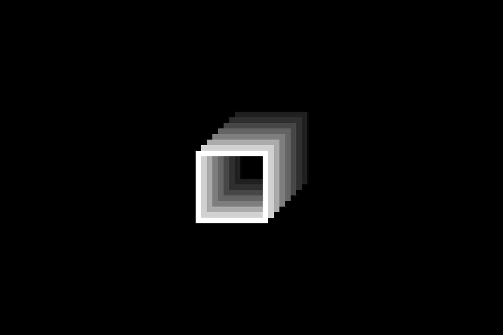

# Color Cycling for Aseprite

A flexible color cycling tool for [Aseprite](https://www.aseprite.org/), inspired by classic Deluxe Paint palette animations.

This script allows you to animate colors by shifting palette indices across frames using multiple motion modes. 

---

## 🚀 Features

Multiple cycle modes:
  - **Default** – Standard forward cycling  
  - **Mirror** – Wave motion using a mirrored palette  
  - **Ping Pong** – Forward and backward motion with no repeating colors  
  - **Random** – Every frame uses a different shuffled color mapping

---

## 📦 Installation

1. Open Aseprite.
2. Go to **File > Scripts > Open Scripts Folder**.
3. Copy `[KS] Color Cycling.lua` into that folder.
4. Go to **File > Scripts > Rescan Scripts Folder**, or press **F5** on your keyboard.
5. Run the script via **File > Scripts > [KS] Color Cycling**.

---

## 🛠️ How to Use

1. Make sure your sprite is in **Indexed** color mode.
2. Select the **cel** you want to apply the effect to.
3. Run the **[KS] Color Cycling** script.
4. Set the following:
   - Start index (e.g. `1`)
   - End index (e.g. `8`)
   - A cycle mode
5. Click **Cycle**.
6. The script will shift pixel colors and generate an animated sequence.

💡 For best results, ensure the selected cel contains colors within the chosen index range.

---

## 📁 Included Files

- `[KS] Color Cycling.lua` – The script itself  
- `LICENSE.txt` – MIT License  
- `README.md` – This file  
- `preview.gif` – Demo animation

---

## 📜 License

MIT License  
See [`LICENSE.txt`](LICENSE.txt) for full details.

---

## 👤 Credits

**Color Cycling for Aseprite**  
Created by **Kerim Safa**  
Website: [https://www.kerimsafa.com](https://www.kerimsafa.com)  
Project page: [https://kerimsafa.itch.io/color-cycling](https://kerimsafa.itch.io/color-cycling)  
X: [https://x.com/kerimsafa](https://x.com/kerimsafa)

---

## 📝 Notes

- Works best on static cels — avoid applying it to layers with existing animations unless you intend to overwrite them.
- To reverse the cycle direction, simply swap the Start Index and End Index values.
- For questions, feature requests, or bug reports, contact: **contact@kerimsafa.com**

🔗 Learn more about the color cycling technique: [https://en.wikipedia.org/wiki/Color_cycling](https://en.wikipedia.org/wiki/Color_cycling)
